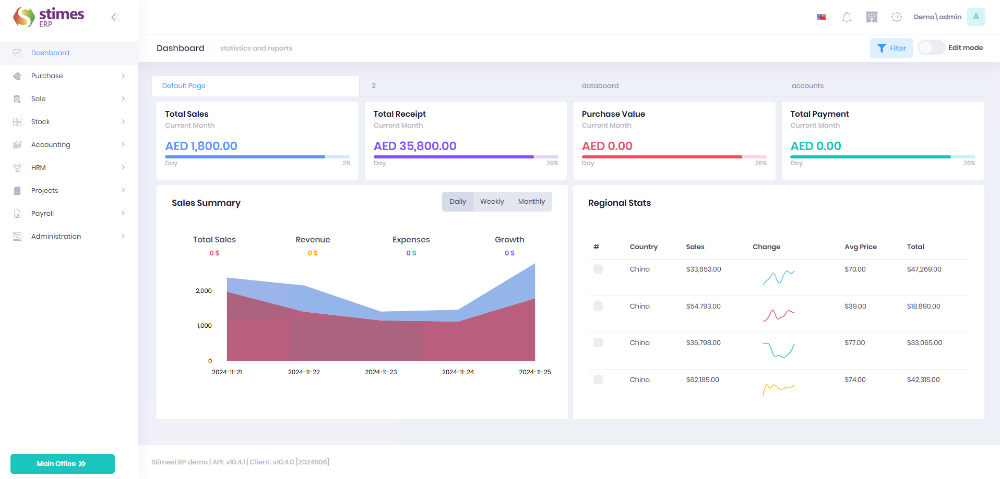

# Dashboard

## overview

The Dashboard Module is the central hub of the ERP system, providing real-time insights into key business metrics. It is designed to be highly customizable, allowing users to tailor it to their operational needs.

## Date Filters

The Date Filter feature allows users to analyze data by specific timeframes for more focused insights.

## Key Features

### Sales and Financial Metrics

    <ul>
        <li><strong>Total Sales:</strong> Displays the cumulative sales value for the current month.</li>
        <li><strong>Total Receipts:</strong> Shows the total funds received during the month.</li>
        <li><strong>Purchase Value:</strong> Reflects the total purchase value for the current month.</li>
        <li><strong>Total Payments:</strong> Indicates all payments made during the current month.</li>
    </ul>

### Sales Summary Graph

Filter data by:
Daily
Weekly
Monthly intervals
Customize filters to analyze sales data for specific dates or months.

### Regional Stats

    <ul>
        <li><strong>Sales by Country:</strong> Visualize sales performance regionally.</li>
        <li><strong>Distribution Map:</strong> Highlights the sales distribution across various regions.</li>
    </ul>

### General Stats

    <ul>
        <li><strong>Operations:</strong> Monitor the number of completed operations.</li>
        <li><strong>New Visits:</strong> Track new website or system visits.</li>
        <li><strong>Bounces:</strong> Understand traffic bounce rates.</li>
    </ul>

### Sales Insights

    <ul>
        <li><strong>Daily Sales Graph:</strong> Visualize daily sales trends over time.</li>
        <li><strong>Profit Share:</strong> Analyze profit share distribution among customers.</li>
    </ul>

### Sales by Salesperson

Provides a detailed breakdown for each salesperson, showing:
Name
Invoice count
Total sales amount

## How to Customize Dashboard (Edit Mode)

The dashboard is fully customizable. Administrators can make adjustments by entering Edit Mode, where they can:

    <ul>
        <li><strong>Add Widget:</strong> Insert new visualizations or metrics.</li>
        <li><strong>Add Page:</strong> Create additional pages for specific data categories.</li>
        <li><strong>Rename Page:</strong> Update page titles to match their purpose.</li>
        <li><strong>Delete Page:</strong> Remove pages that are no longer needed.</li>
        <li><strong>Save Changes:</strong> Apply and save all updates.</li>
    </ul>

  
  

