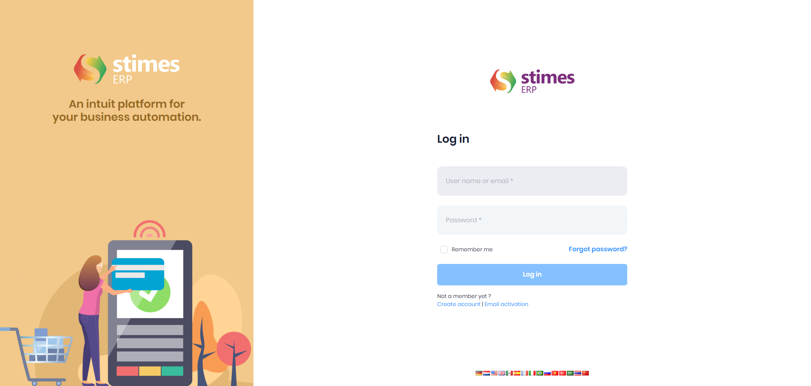

# Getting started with Stimes Trading and Distribution ERP

## Accessing the System/Login

StimesERP software is globally accessible with user credentials. The login page allows users to enter their username and password.
Please enter your username and password here.

## Accessing the Modules 

After logging into the application, users can view a list of modules in the left sidebar. These modules are assigned based on the user's role and permissions.

>       If you cannot see the modules in the left sidebar, please contact your system administrator to assign the appropriate modules to your account.

## Top Bar Overview

    <ul>
        <li><strong>Flag Icon:</strong> Used for changing the language of the application. Switch between supported languages with a single click.</li>
        <li><strong>Bell Icon:</strong> Displays notifications for important system updates, reminders, or alerts.</li>
        <li><strong>Branch Icon:</strong> Indicates the branch currently in use. Use this to view or switch between branches.</li>
        <li><strong>Settings Icon:</strong> Provides quick access to general application settings for configuration.</li>
        <li><strong>Profile Icon:</strong> Access your user profile, manage linked accounts, delegate authority, and update profile information.</li>
    </ul>

## Organization Unit (OU) Switching

At the bottom-left corner of the application, you will find the Organization Unit (OU) option. This allows you to switch seamlessly between different organizational units, enabling better management of multiple entities or divisions.

  
  

